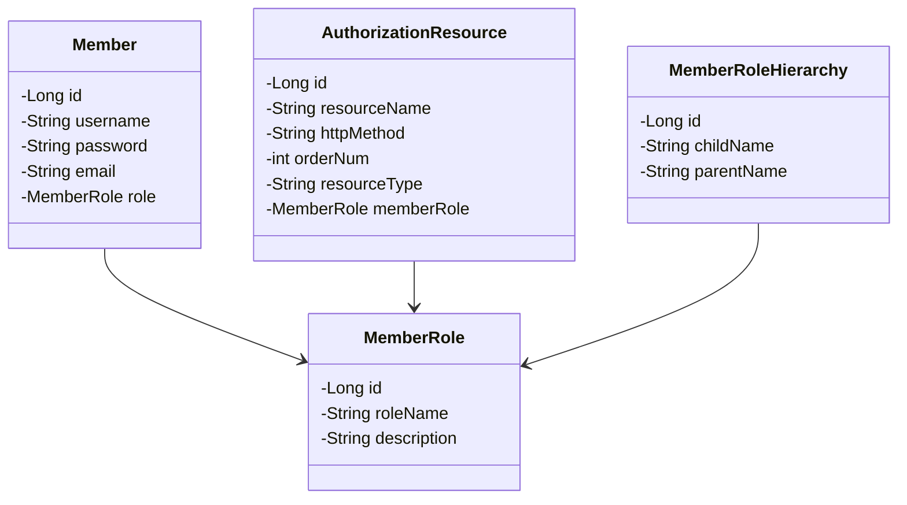
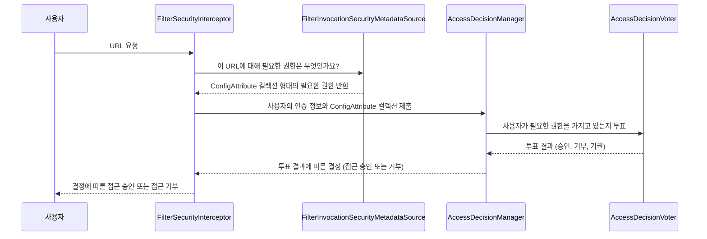

# 인증/인가 관리자 페이지

동적으로 인증/인가 정보를 설정하는 관리자 페이지입니다.

관리자 페이지에서는 "사용자 관리", "리소스 관리", "권한 관리" 기능을 제공하고, 관리자 페이지에서 설정한 내용을 바탕으로 사용자가 접근하려는 리소스에 필요한 권한과 사용자의 권한을 비교하여 접근을 승인/거부 합니다.

`Thymeleaf`와 `Bootstrap`으로 프론트 페이지를 작성하였고, `jQuery`를 사용해서 관리자 설정 페이지가 Single page로 동작하도록 구성했습니다. 

보안 기능에 대한 자세한 설명은 세부정보(Details)에 있습니다.

---

## 사용 기술

### Backend

### Frontend

---

## ERD

---

## 기능

### 회원가입/로그인

form 로그인 방식으로 구현했고, 권한이 필요한 페이지 접근 시에는 로그인 페이지로 리디렉트됩니다.

로그인 후에 권한이 부족한 페이지 접근 시에는 403 Forbidden 페이지로 리디렉트됩니다.

`UsernamePasswordAuthenticationFilter`는 폼 기반의 인증 기본 필터로 직접 인증 과정을 처리하지 않고 `Authentication(UsernamePasswordAuthenticationToken)`을 생성 후 `AuthenticationManager`에 전달하고, `AuthenticationManager`는 등록 된 `AuthenticationManager` 중 적절한 프로바이더를 찾아 실제 인증 작업을 위임합니다.

`Authentication`는 사용자의 인증 정보와 권한을 갖고 있고, 성공적으로 인증되면 `SecurityContext`에 저장됩니다.

`AuthenticationDetailsSource` 인터페이스는 `buildDetails`라는 메서드를 갖고 있고, `HttpServletRequest`를 매개변수로 받아 Remote IP, 세션 ID 등 웹 관련 정보를 담는 `WebAuthenticationDetails`를 생성합니다. 이 `WebAuthenticationDetails`는 `Authentication`의 `details` 속성에 저장됩니다.

### 관리자 페이지

`jQuery`를 사용하여 각 설정 테이블이 SPA로 동작하도록 구현했습니다.

### 사용자 관리

회원으로 등록된 사용자의 정보를 보여줍니다.

### 리소스 관리

각 URL 경로에 접근할 수 있는 권한 레벨을 설정합니다.

[리소스 추가]

인가 처리는 `FilterSecurityInterceptor` 필터에서 처리합니다. Spring Security가 제공하는 보안 필터 중에서 가장 마지막에 위치하는 필터이고, HTTP 요청에 대한 접근을 승인/거부 여부를 최종적으로 결정하는 역할을 합니다.

인증 여부를 먼저 체크하여 인증 객체부터 없으면 `AuthenticationException`을 발생시키고, 접근 권한이 없으면 `AccessDenieException`를 발생시킵니다.

`FilterInvocationSecurityMetadataSource` 인터페이스는 요청된 리소스에 대해 <ins>필요한 권한 정보를 제공</ins>하는 역할을 합니다.

- [UrlFilterInvocationSecurityMetadataSource](pratice/src/main/java/study/security/config/security/authorization/UrlFilterInvocationSecurityMetadataSource.java)

`FilterSecurityInterceptor`는 `FilterInvocationSecurityMetadataSource`에 해당 리소스(URL)에 대해 필요한 권한 정보를 요청하고, `FilterInvocationSecurityMetadataSource`는 필요한 권한 정보를 `ConfigAttribute`의 컬렉션 형태로 반환합니다.

`AccessDecisionManager`는 인증된 사용자의 접근 권한과 HTTP 요청 정보를 비교하여 접근 승인 여부를 결정하는 주체입니다. `AccessDecisionManager`는 `FilterInvocationSecurityMetadataSource`가 반환한 필요 권한 정보와 사용자의 권한 정보를 받아 승인 여부를 결정합니다.

`AccessDecisionManager`는 여러 개의 `AccessDecisionVoter`를 가질 수 있으며, 각 `AccessDecisionVoter`들은 인증된 사용자가 접근할 수 있는지 투표하는 역할을 합니다.

`AccessDecisionManager`의 유형으로는 `AffirmativeBased`, `ConsensusBased`, `UnanimousBased`가 있는데 보통 `AffirmativeBased`를 사용합니다.

### 권한 관리

사용자 권한(Role) 정보를 동적으로 관리합니다.

[권한 추가]

[권한 계층 설정]

`RoleHierarchy`로 각 권한에 계층 관계를 설정하여, 상위 권한을 갖는 사용자가 하위 권한으로 설정 된 리소스에 접근이 가능합니다.

설정한 `RoleHierarchy`를 갖는 `RoleHierarchyVoter`를 생성하여 인가 Voter로 등록합니다.

[RoleHierarchy 적용 코드](pratice/src/main/java/study/security/config/security/authorization/AuthorizationBeans.java)

### 인가 테스트

리소스에 설정한 인가 권한을 테스트할 수 있는 링크 버튼입니다.

---

## Reference

- 정수원 - 스프링 시큐리티