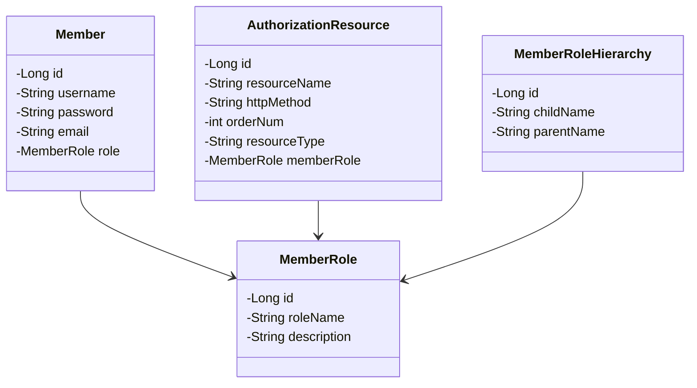

# 인증/인가 관리자 페이지

동적으로 인증과 인가 정보를 설정하는 관리자 페이지입니다.

`Thymeleaf`와 `Bootstrap`으로 프론트 페이지를 작성하였고, `jQuery`를 사용해서 관리자 설정 페이지는 Single page로 동작하도록 구성했습니다. 

---

## 사용 기술

### Backend

### Frontend

---
## ERD

---

## 기능

### 회원가입/로그인

form 로그인 방식으로 구현했고, 권한이 필요한 페이지 접근 시에는 로그인 페이지로 이동됩니다.

로그인 후에 권한이 부족한 페이지 접근 시에는 403 Forbidden 페이지로 이동하도록 구성했습니다.

### 관리자 페이지

`jQuery`를 사용하여 각 설정 테이블이 SPA로 동작합니다.

### 사용자 관리

회원으로 등록된 사용자의 정보를 보여줍니다.

### 권한 관리

사용자 권한(Role) 정보를 동적으로 관리합니다.

`RoleHierarchy`로 각 권한에 계층 관계를 설정하여, 상위 권한을 갖는 사용자가 하위 권한으로 설정 된 리소스에 접근이 가능합니다.

- 권한 계층 설정

    

- 권한 추가

    

### 리소스 관리

각 URL 경로에 접근할 수 있는 권한 레벨을 설정합니다.

- 리소스 추가

### 인가 테스트

리소스에 설정한 인가 권한을 테스트할 수 있는 링크 버튼입니다.