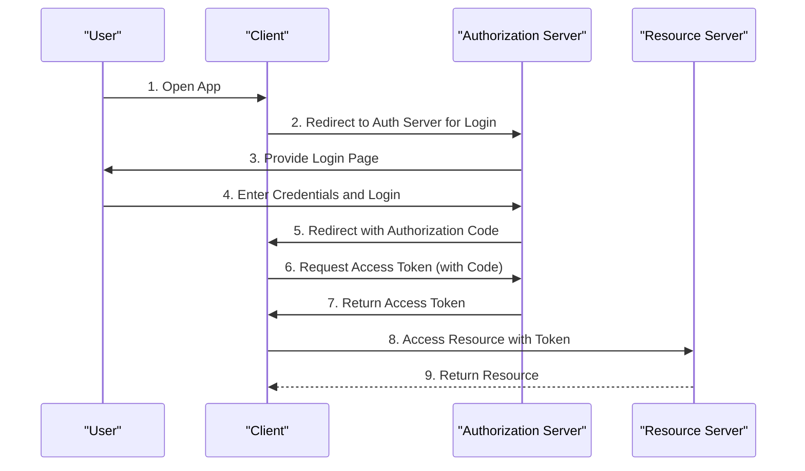

# OAuth2 로그인 구현하기 - 로그인 과정 디버깅

## 용어

### Roles

[공식 문서 section-1.1](https://datatracker.ietf.org/doc/html/rfc6749#section-1.1)에서는 아래 4개의 역할을 정의한다.

1. Resource Owner
   - 리소스 소유자는 사용자로, 자신의 계정 데이터에 대한 접근 권한을 부여할 수 있는 개체입니다.
2. Resource Server
   - 리소스 서버는 리소스 소유자의 데이터를 호스팅하는 서버로, 보호된 리소스에 대한 접근을 처리합니다.
3. Authorization Server
   - 인증 서버는 사용자의 신원을 확인하고, 클라이언트에게 토큰을 발급하는 역할을 합니다.
   - 이 토큰은 클라이언트가 리소스 서버에 접근할 수 있는 권한을 부여합니다.
   - 아래 설명 중 나오는 Provider와 같습니다. (google, kakao, naver 등)
4. Client
   - 클라이언트는 리소스 소유자의 데이터에 접근을 요청하는 애플리케이션입니다.
   - 웹 서비스, 모바일 앱 등이 될 수 있습니다.

## OAuth2 로그인 과정

### Authorization Code Grant 방식

여러 Grant 방식이 있지만, 여기서는 안전하고 흔히 사용하는 방식인 `Authorization Code Grant`만 설명합니다.

`Authorization Code Grant`는 크게 3가지 단계로 진행 된다.

> 나중에 이 단계를 따라 Spring OAuth2 디버깅을 진행합니다.

1. [Authorization Endpoint에 code 요청](#1단계-authorization-endpoint에-code-요청)
   - Client는 User를 설정 정보와 함께 Authorization Endpoint로 리디렉션한다.
   - Provider는 로그인 페이지로 리디렉션하여 사용자의 신원을 인증하고 권한을 요청한다.
   - 사용자가 로그인하고 권한을 승인하면, Provider는 URL에 인증 코드를 포함하여 Client로 리디렉션한다.
2. [Token Endpoint에 Token 요청](#2단계-token-endpoint에-token-요청)
   - Client는 받은 인증 코드와 Client ID/Secret 등을 포함하여 Token Endpoint에 Token을 요청한다.
   - access_token, refresh_token 등을 발급 받고, OIDC 프로토콜을 사용한다면 id_token도 발급 받는다.
3. [UserInfo Endpoint에 UserInfo 요청](#3단계-userinfo-endpoint에-userinfo-요청)
   - Client는 Access Token으로 UserInfo Endpoint에 사용자 정보를 요청한다.
   - id_token(JWT 포맷)을 발급 받았다면, 이 Endpoint에 접근할 필요없이 id_token에서 정보를 꺼낸다.
4. [인증 객체 생성](#4단계-인증-객체-생성)
   - UserInfo로부터 인증 객체를 생성한다.



## 설정

### Well-known 엔드포인트

출처: [Google OpenID Coonect 문서](https://developers.google.com/identity/openid-connect/openid-connect?hl=ko#discovery)

> OpenID Connect 프로토콜은 사용자를 인증하고 토큰, 사용자 정보, 공개 키를 포함한 리소스를 요청하기 위해 여러 엔드포인트를 사용해야 합니다. 

> 구현을 간소화하고 유연성을 높이기 위해 OpenID Connect는 승인, 토큰, 취소, 사용자 정보, 공개 키 엔드포인트의 URI를 포함하여 OpenID Connect 제공업체의 구성에 대한 세부정보를 제공하는 잘 알려진 위치에서 발견된 JSON 문서인 '검색 문서'를 사용할 수 있도록 허용합니다. 

Well-known 엔드포인트를 활용하면, 애플리케이션 설정을 간소화 할 수 있습니다.

<details>

<summary>Kakao의 Well-known JSON</summary>

```json
{
  "issuer": "https://kauth.kakao.com",
  "authorization_endpoint": "https://kauth.kakao.com/oauth/authorize",
  "token_endpoint": "https://kauth.kakao.com/oauth/token",
  "userinfo_endpoint": "https://kapi.kakao.com/v1/oidc/userinfo",
  "jwks_uri": "https://kauth.kakao.com/.well-known/jwks.json",
  "token_endpoint_auth_methods_supported": ["client_secret_post"],
  "subject_types_supported": ["public"],
  "id_token_signing_alg_values_supported": ["RS256"],
  "request_uri_parameter_supported": false,
  "response_types_supported": ["code"],
  "response_modes_supported": ["query"],
  "grant_types_supported": ["authorization_code", "refresh_token"],
  "code_challenge_methods_supported": ["S256"],
  "claims_supported": [
    "iss",
    "aud",
    "sub",
    "auth_time",
    "exp",
    "iat",
    "nonce",
    "nickname",
    "picture",
    "email"
  ]
}
```

</details>

<details>

<summary>간소화 된 application.yml 설정</summary>

```yaml
spring:
  security:
    oauth2:
      client:
        registration:
          kakao:
#            client-id: application-dev.yml
#            client-secret: application-dev.yml
            redirect-uri: http://localhost:8080/login/oauth2/code/kakao
            authorization-grant-type: authorization_code
            scope: openid,profile_nickname,profile_image,account_email
        provider:
          kakao:
            # "issuer-uri"만 있으면 모든 Endpoint를 알아서 가져온다.
            # https://kauth.kakao.com/.well-known/openid-configuration
            issuer-uri: https://kauth.kakao.com
```

</details>

[Well-known 엔드포인트 포맷 및 예시]

well-known 엔드포인트 포맷이 정해져 있으므로 `issuer-uri`만 설정하면 다음 경로에서 메타 데이터를 수집합니다.

```bash
포맷 : "https://{issuer-uri}/.well-known/openid-configuration"
Kakao : https://kauth.kakao.com/.well-known/openid-configuration
Google : https://accounts.google.com/.well-known/openid-configuration
naver : 네이버는 OIDC를 지원하지 하지 않아, 엔드포인트가 없음
```

### 

## Spring OAuth2 로그인 과정 디버깅

### 1단계: Authorization Endpoint에 code 요청

이 로그인 버튼은 "http://localhost:8080/oauth2/authorization/kakao" 경로로 링크되어 있고, Code 요청 URI를 자동으로 생성하여 리디렉션합니다.

[OAuth2AuthorizationRequestRedirectFilter]

이 클래스에서 Code를 요청하는 URI를 생성하여 Authorization Endpoint로 리디렉션하는 과정을 볼 수 있다.

`OAuth2AuthorizationRequestRedirectFilter#sendRedirectForAuthorization` 에 디버깅 포인트 설정

- `redirectUri`가 "/login/oauth2/code/kakao"로 설정되어 있다. Provider는 이 경로로 발급한 code를 전달한다.


```bash
# 생성된 URI
https://kauth.kakao.com/oauth/authorize?response_type=code&client_id=bae9aa27df816d042ef63a7e710aba74&scope=openid%20profile_nickname%20profile_image%20account_email&state=CmJpTmvZ_wrAkYSC9AMXHpeB-gJ9FZ2gtkhu41rrcGs%3D&redirect_uri=http://localhost:8080/login/oauth2/code/kakao&nonce=wlBvOV6TpnEldBtNsTJl_Qh5QKyKPzlBclussGPk5pk
```

### 2단계: Token Endpoint에 Token 요청

[OAuth2LoginAuthenticationFilter]

`OAuth2LoginAuthenticationFilter#attemptAuthentication`에 디버깅 포인트


- 사용자가 로그인하고 권한을 승인한 후, Provider가 발급한 code를 확인
- 이 메서드에서 code를 token으로 바로 교환한다.
- Token 교환을 확인하려면 authenticate() 메서드만 찾아 따라 들어가면 된다.

```text
AuthenticationManager
  -> OidcAuthorizationCodeAuthenticationProvider 
    -> DefaultAuthorizationCodeTokenResponseClient
```

[DefaultAuthorizationCodeTokenResponseClient]

- 여기서 Code를 Token으로 교환하는 Request와 Response를 확인할 수 있다.
- request와 Response의 body를 확인


### 3단계: UserInfo Endpoint에 UserInfo 요청

OpenID Connect 프로토콜을 사용하기 때문에 UserInfo Endpoint에 요청하지 않고, ID Token에서 User 정보를 꺼냅니다.

[OidcAuthorizationCodeAuthenticationProvider]

위에서 토큰 교환을 진행한 `OidcAuthorizationCodeAuthenticationProvider` 클래스의 authenticate 메서드를 따라
`OidcAuthorizationCodeAuthenticationProvider#createOidcToken`에 디버깅 포인트를 찍으면
JWT로부터 OidcIdToken을 생성하는 과정을 확인 할 수 있습니다.


### 4단계: 인증 객체 생성

위에서 생성한 OidcIdToken을 기반으로 OAuth2User(OidcUser)를 만들어 Authentication의 principal 속성에 저장한다.


## Reference

- 정수원 - 스프링 시큐리티 OAuth2